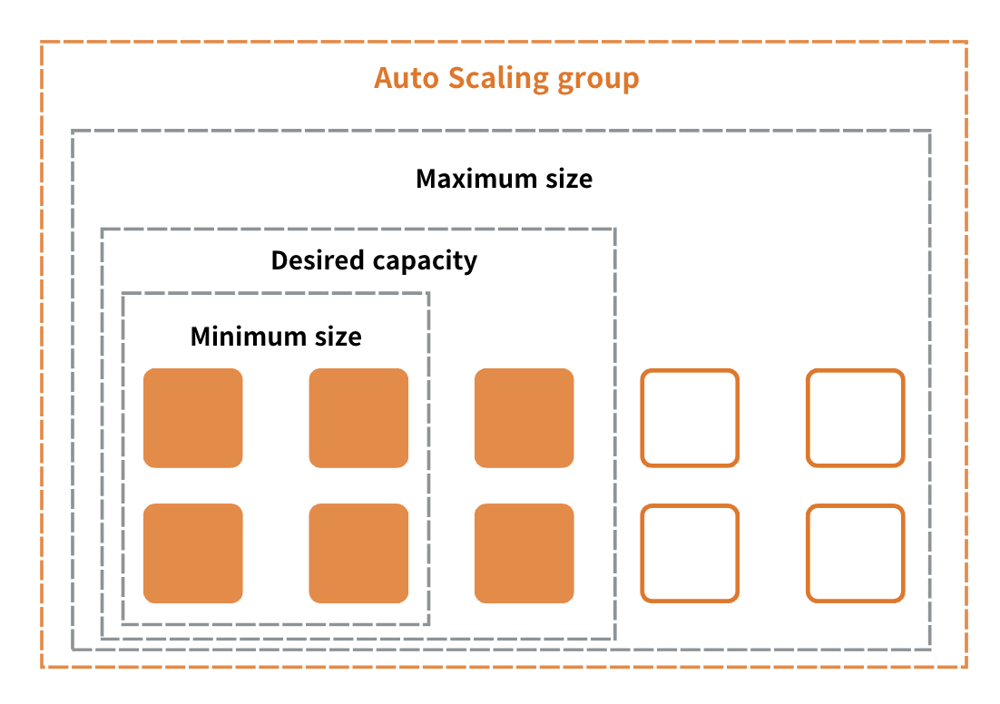
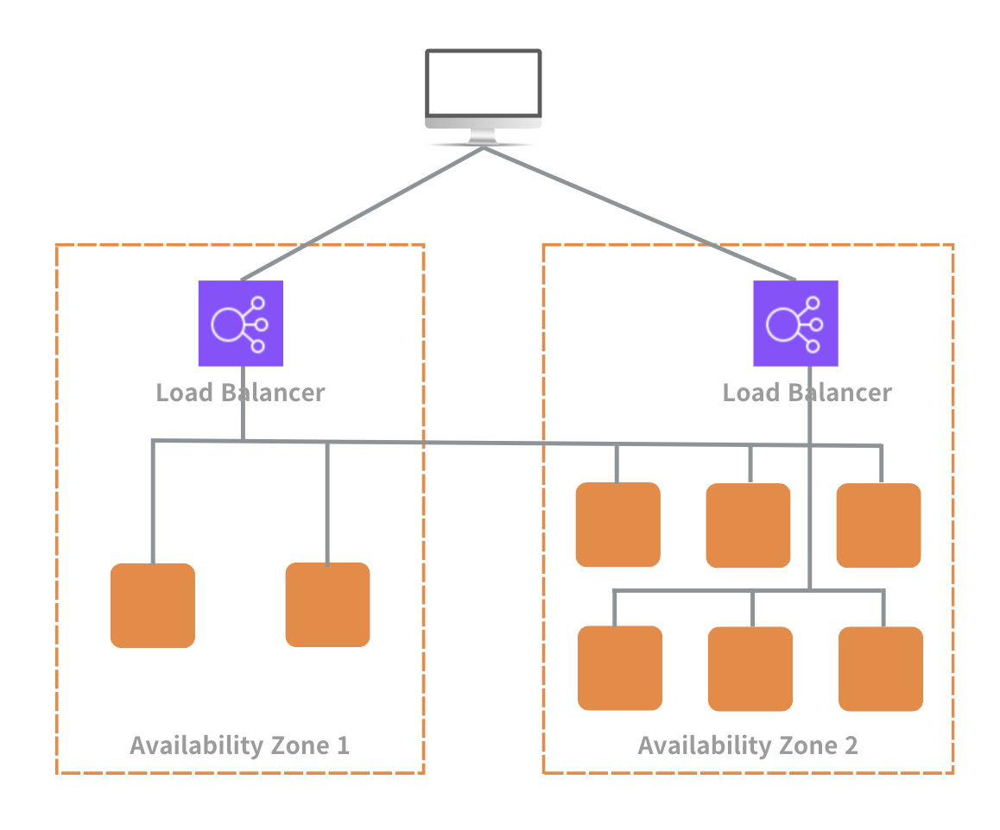

## ✅ 문제 1) 30TB/day 클릭스트림 데이터 전송 & 처리 플랫폼

###   요구사항 정리
- **글로벌 웹/앱 300개+** 운영 → 트래픽/이벤트 소스가 매우 많음
- **매일 30TB+ 클릭스트림 분석** → 대용량 데이터 저장/분석 필요
- **클릭스트림 데이터를 전송하고 처리** → *스트리밍 수집 + 적재 + 분석 파이프라인* 필요
- **운영 부담 최소화** → 관리형/서버리스 선호

---

## 1️⃣ 300개 이상의 글로벌 웹사이트와 애플리케이션 호스팅

대규모 글로벌 서비스를 운영하려면 확장성과 가용성을 동시에 고려해야 한다.  
수백 개의 웹사이트와 애플리케이션이 동작하는 환경에서는 트래픽 급증이나 서버 장애가 곧 서비스 중단으로 이어질 수 있기 때문이다.

이를 해결하기 위해 대표적으로 활용되는 서비스가 Amazon EC2이다.

---

### 🖥 Amazon EC2 (Elastic Compute Cloud)

Amazon EC2는 필요에 따라 컴퓨팅 자원을 생성하고 제거할 수 있는 클라우드 가상 서버 서비스다.  
사용자는 원하는 사양의 서버를 즉시 생성하여 사용할 수 있으며, 보안 설정과 네트워크 구성, 스토리지 연결까지 직접 제어할 수 있다.

- **확장 가능한 온디맨드 컴퓨팅 용량**  
  → 필요할 때 서버를 늘리고, 필요 없을 때 줄일 수 있는 구조를 의미한다.

- **프로비저닝(Provisioning)**  
  → IT 자원을 요청 즉시 사용할 수 있도록 준비하는 과정을 뜻한다.

즉, EC2는 인터넷 기반으로 유연하게 확장 가능한 서버 환경을 제공하는 핵심 인프라 서비스다.

---

대규모 글로벌 서비스에서는 다음과 같은 상황이 자주 발생한다.

- 특정 시간대에 트래픽 급증
- 예상치 못한 서버 장애
- 지역별 사용자 수 급격한 증가

이러한 문제를 해결하기 위해 EC2와 함께 사용되는 서비스가 있다.

---

### 📈 Amazon EC2 Auto Scaling

Auto Scaling은 트래픽 변화에 따라 EC2 인스턴스 수를 자동으로 조절하는 서비스다.

- 부하가 증가하면 인스턴스를 자동으로 추가한다.
- 부하가 감소하면 불필요한 인스턴스를 제거한다.
- 항상 적정 수준의 용량을 유지한다.

이를 통해 애플리케이션 가용성을 높이고, 동시에 불필요한 비용을 줄일 수 있다.

> 

- **애플리케이션 가용성(Application Availability)**  
  → 서비스가 중단 없이 정상적으로 동작하는 시간 비율을 의미한다.

---

### ⚖️ Elastic Load Balancing (ELB)

Elastic Load Balancing은 사용자 요청을 여러 서버로 분산시키는 역할을 한다.

- 여러 가용 영역(Availability Zone)에 걸쳐 트래픽을 분산한다.
- 특정 인스턴스 장애 발생 시 자동으로 다른 인스턴스로 우회한다.
- 단일 장애 지점을 제거하여 안정성을 확보한다.

> 

---

### 🗄 Amazon S3 (Simple Storage Service)

Amazon S3는 대규모 데이터를 저장할 수 있는 객체 스토리지 서비스다.

클릭스트림 데이터와 같은 로그 데이터는 지속적으로 대량 생성되므로,  
확장 제한이 없고 높은 내구성을 가진 스토리지가 필요하다.

S3는 이러한 로그 데이터를 안정적으로 보관하는 데이터 레이크 역할을 수행한다.

## 2️⃣ 매일 30TB 이상의 클릭스트림 데이터 분석

매일 30TB 이상의 클릭스트림 데이터를 분석해야 한다는 것은  
단순 저장이 아니라 **대규모 데이터 분석 플랫폼**이 필요하다는 의미다.

이 경우 고려해야 할 요소는 다음과 같다.

- 대용량 데이터 저장
- 빠른 SQL 기반 분석
- 비용 효율성
- 확장성

이를 위해 활용할 수 있는 대표 서비스는 다음과 같다.

---

### 🏢 Amazon Redshift

Amazon Redshift는 대규모 데이터를 분석하기 위한 클라우드 데이터 웨어하우스 서비스다.  
수십 테라바이트 이상의 데이터를 빠르게 쿼리할 수 있도록 설계되어 있다.

쉽게 말하면 Redshift는  
방대한 데이터를 체계적으로 정리해두고, 필요할 때 빠르게 꺼내볼 수 있는 디지털 분석 창고와 같다.

대량의 데이터를 집계하고, 복잡한 SQL 쿼리를 실행하며,  
비즈니스 의사결정을 위한 분석 작업을 수행하는 데 적합하다.

---

### 📦 Amazon Redshift Spectrum

Redshift는 데이터를 내부 테이블로 적재해야 분석할 수 있다.  
그러나 데이터 적재 과정에는 시간과 비용이 발생한다.

이 문제를 해결하기 위해 Redshift Spectrum을 사용할 수 있다.

- S3에 저장된 데이터를 Redshift로 옮기지 않고 직접 쿼리 가능
- 정형 및 비정형 데이터 분석 가능
- 데이터 이동 비용 절감

즉, Spectrum은 Redshift의 확장 분석 기능이라고 볼 수 있다.

---

### 🧮 Amazon Athena

Athena는 S3에 저장된 데이터를 직접 SQL로 조회할 수 있는 서버리스 분석 서비스다.

- 별도의 서버 운영 필요 없음
- 사용한 쿼리 양만큼 과금
- 대규모 로그 데이터 분석에 적합

30TB 이상의 데이터를 정기적으로 분석해야 하는 경우,  
Athena는 데이터 웨어하우스를 구성하지 않고도 빠르게 분석을 수행할 수 있는 대안이 된다.

---

### 📊 Amazon QuickSight

QuickSight는 클라우드 기반 BI 서비스다.

- 분석 결과를 시각화
- 대시보드 생성
- 비즈니스 의사결정 지원

클릭스트림 데이터를 단순히 분석하는 것을 넘어  
경영진이나 실무자가 이해하기 쉬운 형태로 표현하는 역할을 수행한다.

---

## 3️⃣ 클릭스트림 데이터를 전송하고 처리

30TB 규모의 데이터는 단순 저장이 아니라  
**실시간 수집과 처리 파이프라인**이 필요하다.

이를 위해 활용되는 대표 서비스는 Kinesis 계열이다.

---

### 🌊 Amazon Kinesis

Kinesis는 대규모 스트리밍 데이터를 실시간으로 수집하고 처리하는 서비스다.

---

### 🔄 Kinesis Data Streams

- 실시간 데이터 수집
- 높은 처리량
- 낮은 지연 시간
- 여러 소비자 애플리케이션으로 동시 전달 가능

지속적으로 발생하는 클릭 이벤트를 안정적으로 받아들이는 역할을 한다.

---

### 🚚 Kinesis Data Firehose

- 수집된 데이터를 자동으로 배치
- 데이터 포맷 변환 가능
- S3, Redshift 등으로 자동 전송
- 관리 부담 최소화

Streams가 데이터를 받아들이는 역할이라면,  
Firehose는 그 데이터를 정리하여 저장소로 보내는 역할을 한다.

---

### ⚙️ AWS Lambda

Lambda는 이벤트 기반으로 코드를 실행하는 서버리스 컴퓨팅 서비스다.

- 서버를 직접 관리할 필요 없음
- 특정 이벤트 발생 시 자동 실행
- 데이터 변환 및 후처리 가능

여기서 “서버리스”는 서버가 없다는 의미가 아니다.  
서버는 존재하지만, 사용자가 직접 인프라를 관리하지 않아도 된다는 의미다.

---

## 🔎 선택지 분석

### ❌ 선택지 1: S3 + EMR + Data Pipeline

- EMR은 대규모 배치 처리에 적합
- Data Pipeline은 정기적인 데이터 이동 자동화에 적합
- 실시간 스트리밍 처리에는 적합하지 않음
- 운영 복잡도 증가

클릭스트림은 지속적으로 발생하는 데이터이므로  
배치 중심 아키텍처는 요구사항에 맞지 않는다.

---

### ❌ 선택지 2: EC2 Auto Scaling 기반 처리

- 직접 인프라 구성 필요
- 스트리밍 수집 계층이 부족
- 운영 오버헤드 증가

대규모 스트리밍 데이터에는 전용 스트리밍 서비스가 더 적합하다.

---

### ❌ 선택지 3: CloudFront + S3 + Lambda

- CloudFront는 콘텐츠 전송(CDN) 목적
- Lambda는 대규모 지속 처리에 한계 존재
- 구조 복잡성 증가 가능

데이터 수집 파이프라인으로 보기 어렵다.

---

### ✅ 선택지 4: Kinesis Data Streams → Firehose → S3 → Redshift

- 실시간 데이터 수집
- 자동 변환 및 적재
- 대용량 데이터 저장
- 고성능 분석 가능
- 운영 오버헤드 최소화

스트리밍 수집 + 자동 적재 + 대규모 분석이라는 요구사항을 모두 충족한다.

---

## ✅ 결론

첫 번째 문제의 정답은 **선택지 4번**이다.

대규모 클릭스트림 데이터 분석 문제에서  
“실시간 수집 + 자동 적재 + 데이터 웨어하우스 분석” 구조가 보이면  
Kinesis 기반 아키텍처를 먼저 떠올리는 것이 시험 전략상 유리하다.
