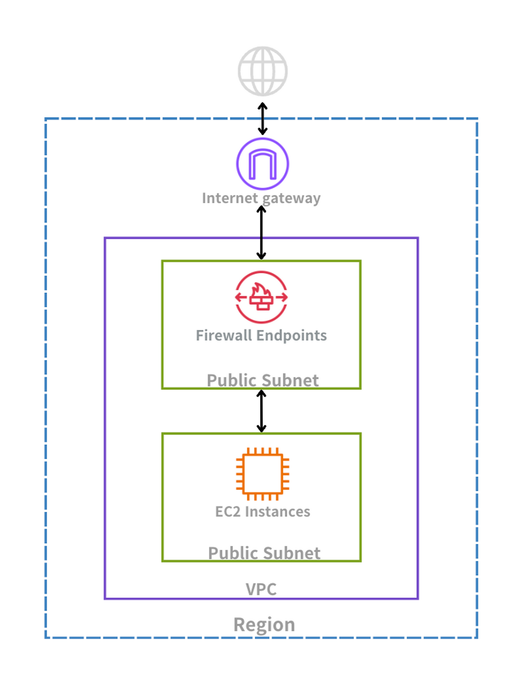
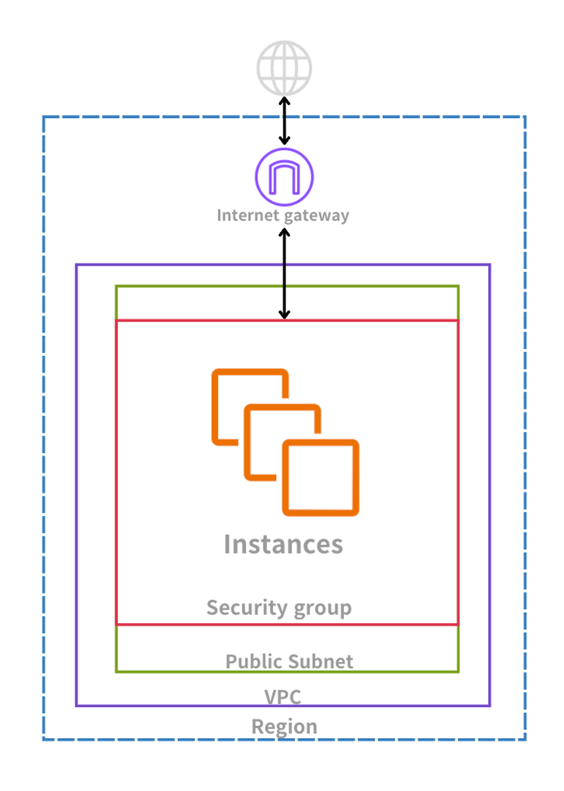

## ✅ 문제 3) 프라이빗 서브넷 EC2의 아웃바운드 인터넷 접근을 “승인된 URL만” 허용하기

### 🧩 문제 요약
민감 데이터를 가진 EC2 인스턴스가 **프라이빗 서브넷**에서 실행된다.  
회사 정책상 해당 인스턴스는 소프트웨어 업데이트를 위해 **승인된 타사 소프트웨어 리포지토리(URL/도메인)** 에만 접근할 수 있어야 한다.  
그 외 모든 인터넷 트래픽은 차단해야 한다.

---

## 1️⃣ 요구사항 분석
이 문제에서 중요한 포인트는 다음 두 가지다.

- **VPC 네트워크 보호**
- **프라이빗 서브넷에서 실행**
- (추가 핵심) **“URL/도메인” 기반으로 아웃바운드 트래픽을 허용/차단해야 함**

여기서 “URL/도메인 기반 제어”가 나오면  
단순 보안그룹/네트워크 ACL만으로는 한계가 생긴다는 점을 떠올려야 한다.

---

## 2️⃣ 요구사항과 관련된 AWS 보안 서비스 정리

### 🧱 AWS WAF (Web Application Firewall)
AWS WAF는 웹 애플리케이션을 악성 트래픽으로부터 보호하는 서비스다.  
주로 **HTTP/HTTPS 요청**을 검사해 웹 공격을 방어한다.

- SQL Injection
- Cross-Site Scripting(XSS)

웹 서비스를 보호할 때 유용하며, “웹 요청” 중심으로 동작한다.

#### 🧠 공격 개념 정리
- **XSS(크로스 사이트 스크립팅)**  
  사용자가 입력하는 값에 악성 스크립트를 삽입해 다른 사용자의 브라우저에서 실행되도록 만드는 공격이다.  
  세션 탈취나 사용자 정보 유출로 이어질 수 있다.

- **SQL Injection**  
  입력값에 SQL 구문을 끼워 넣어 데이터베이스 쿼리를 조작하는 공격이다.  
  인증 우회, 데이터 유출, 데이터 삭제 등 심각한 피해로 이어질 수 있다.

---

### 🔥 AWS Network Firewall
AWS Network Firewall은 VPC 수준에서 트래픽을 검사하고 제어하는 **관리형 네트워크 방화벽**이다.  
VPC 전체에 정책을 적용할 수 있고, 아웃바운드 트래픽을 강제로 통과시키도록 라우팅 설계도 가능하다.

> 

#### 🧭 간단 구조 설명
인터넷에서 들어오는 트래픽이 Internet Gateway를 통과한 후  
퍼블릭 서브넷 영역에서 방화벽 정책으로 필터링되고,  
허용된 트래픽만 내부 리소스로 전달되는 구조를 만들 수 있다.  
이런 다층 방어 방식으로 네트워크 보안을 강화한다.

---

### 🛡 AWS Security Group
Security Group은 인스턴스 수준에서 트래픽을 제어하는 방화벽 역할을 한다.  
주로 EC2, RDS, ELB 등 리소스 단위로 적용된다.

> 

#### 특징 요약
- 인바운드/아웃바운드 규칙 설정 가능
- 하지만 기본적으로 **IP/포트** 단위 제어 중심이며  
  **도메인(URL) 기반 필터링에는 한계**가 있다.

---

### 🚧 Network ACL (NACL)
NACL은 서브넷 단위에서 트래픽을 제어하는 보안 계층이다.

> 
#### 특징 요약
- 서브넷 레벨에서 동작
- 서브넷에 속한 모든 리소스에 영향
- 역시 **IP/포트 기반 제어** 중심이며  
  도메인(URL) 기준으로 허용 목록을 관리하기 어렵다.

---

## ✅ 정답 판단 포인트 (시험 핵심)
이 문제는 “프라이빗 서브넷의 EC2가 인터넷으로 나가야 하는데,  
**승인된 도메인만 허용하고 나머지는 차단**해야 한다”가 핵심이다.

즉, 필요한 것은 다음이다.

- 아웃바운드 트래픽을 **중앙에서 강제 통제**
- **도메인(Allowlist) 기반 필터링**

따라서, **Network Firewall + 라우팅 테이블 강제 통과 + 도메인 목록 규칙**이 가장 깔끔하게 맞아떨어진다.

## 🔎 선택지 분석

이 문제의 핵심은 다음이다.

- 프라이빗 서브넷의 EC2 인스턴스가 인터넷으로 나가야 한다.
- 그러나 **승인된 타사 소프트웨어 리포지토리(URL/도메인)** 에만 접근해야 한다.
- 그 외 모든 인터넷 트래픽은 차단해야 한다.

즉, **아웃바운드 트래픽을 중앙에서 통제하고 도메인 기반으로 필터링**할 수 있어야 한다.

---

### ✅ 선택지 1  
**프라이빗 서브넷의 라우팅 테이블을 수정하여 아웃바운드 트래픽을 AWS Network Firewall로 전달하고, 도메인 목록 규칙 그룹을 구성**

AWS Network Firewall은 VPC 수준에서 트래픽을 검사하고 제어하는 관리형 방화벽이다.

- 상태 기반(Stateful) 트래픽 검사 지원
- 네트워크 및 애플리케이션 레벨 필터링 가능
- 도메인 기반(Allowlist) 정책 설정 가능
- IPS 기능 포함

라우팅 테이블을 수정해 모든 아웃바운드 트래픽이 방화벽을 거치도록 강제할 수 있다.  
그 후 도메인 목록 규칙 그룹을 사용하면 승인된 리포지토리 도메인만 허용하고,  
그 외 도메인은 차단하는 구조를 만들 수 있다.

👉 요구사항인 **도메인 기반 아웃바운드 통제**를 정확히 충족한다.  
따라서 이 선택지가 정답이다.

---

### ❌ 선택지 2  
**AWS WAF 웹 ACL을 사용하여 IP 기반 필터링**

AWS WAF는 웹 애플리케이션 보호를 위한 서비스다.

- HTTP/HTTPS 요청 검사
- SQL Injection, XSS 방어

그러나 WAF는 주로 **인바운드 웹 요청 보호**에 사용된다.  
VPC 내부 인스턴스의 **아웃바운드 트래픽 제어** 목적에는 적합하지 않다.

또한, 문제는 “도메인 기반 접근 통제”인데  
WAF는 이 요구를 VPC 차원에서 해결하기 어렵다.

---

### ❌ 선택지 3  
**Security Group 아웃바운드 규칙에서 URL 지정**

Security Group은 인스턴스 수준의 방화벽이다.

- 인바운드/아웃바운드 트래픽 제어 가능
- 그러나 기본적으로 IP/포트 기반 제어 중심

Security Group은 **도메인(URL) 기준으로 트래픽을 필터링할 수 없다.**  
IP 기반으로는 설정 가능하지만,  
외부 소프트웨어 리포지토리의 IP는 변경될 수 있어 정책 유지가 어렵다.

따라서 요구사항을 충족하지 못한다.

---

### ❌ 선택지 4  
**EC2 앞에 ALB를 두고 아웃바운드 트래픽을 ALB로 전달**

ALB는 기본적으로 **인바운드 트래픽 분산**을 위한 서비스다.

- HTTP/HTTPS 요청을 받아 대상 그룹으로 전달
- 경로/호스트 기반 라우팅 지원

그러나 ALB는 아웃바운드 트래픽 제어용으로 설계되지 않았다.  
또한 URL 기반 아웃바운드 필터링 기능도 제공하지 않는다.

아키텍처 설계 자체가 목적과 맞지 않는다.

---

## ✅ 최종 정답

**선택지 1번 (AWS Network Firewall + 도메인 목록 규칙 그룹 구성)**

---

## 🧠 시험 포인트 정리

- 웹 애플리케이션 보호 → **WAF**
- 인스턴스 단위 포트/IP 제어 → **Security Group**
- 서브넷 단위 포트/IP 제어 → **NACL**
- VPC 전체 아웃바운드/도메인 기반 통제 → **Network Firewall**

문제에서 “도메인 기반 허용 목록(Allowlist)”과  
“프라이빗 서브넷의 아웃바운드 통제”가 나오면  
Network Firewall을 먼저 떠올리는 것이 시험 전략상 유리하다.
